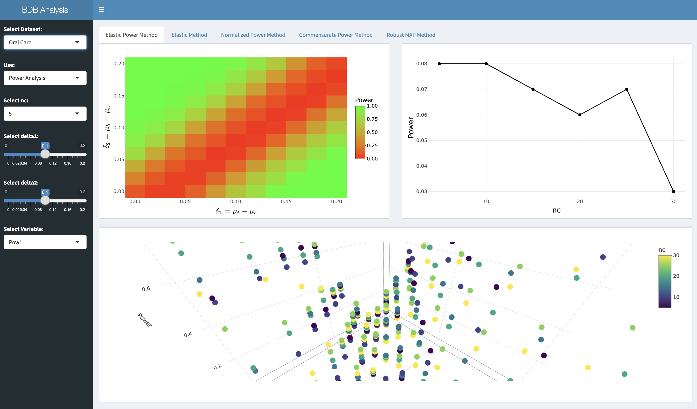

# Bayesian Dynamic Borrowing Project Repository

## Project Description

Our collaborative project with Procter & Gamble (P&G) explores the application of Bayesian Dynamic Borrowing (BDB) methodologies to optimize Randomized Controlled Trials (RCTs) in oral care and face cream datasets using historical data integration. The primary aim is to reduce sample size requirements for control groups while maintaining statistical rigor. We focus on developing adaptive strategies that incorporate historical data into current trials, thereby enhancing efficiency and accelerating decision-making in clinical studies.

We evaluate various BDB techniques such as power priors, commensurate priors, Elastic Priors, Bayesian hierarchical models, and meta-analytic-predictive priors. Through simulations and analysis, we assess these methods’ performance in oral care and face cream datasets, particularly examining bias, variance, and statistical power across different scenarios of treatment and historical data alignment.

Initial findings suggest that methods like the power prior and commensurate prior effectively control bias, while the Elastic Prior provides a balanced approach considering bias, variance, and computational efficiency, especially in scenarios of partial congruence between historical and current trial data.

Furthermore, we demonstrate the application of these methodologies through sample analyses, such as varying the means of treatment and control groups, and historical versus control groups, exploring the impact of individual noise, and assessing how historical data influences treatment distributions in a Round-robin model. This research not only highlights the practical advantages of advanced Bayesian techniques in oral care and cosmetic product trials but also contributes to advancing statistical methodology in clinical trial design and analysis.

## Repository Structure

```plaintext
.
├── Face_Cream
│   ├── commensurate.R
│   ├── elastic.R
│   ├── normalized.R
│   ├── power.R
│   └── results
│       └── elastic_results_nc_fc_temp.csv
├── Oral_Care
│   ├── Plot_Result.R
│   ├── commensurate.R
│   ├── elastic.R
│   ├── elastic_power.R
│   ├── normalized.R
│   ├── results
│   │   ├── commensurate_results_nc.csv
│   │   ├── elastic_power_results_nc.csv
│   │   ├── elastic_results_nc.csv
│   │   ├── normalized_results_nc.csv
│   │   └── rMAP_results_nc.csv
│   └── robust_map.R
├── README.md
├── app
│   ├── app.R
│   ├── helper.R
│   ├── helper_fc.R
│   ├── helper_oc.R
│   ├── results_fc
│   │   ├── elastic_results_nc_fc.csv
│   │   ├── elastic_results_tau1_updated.csv
│   │   └── elastic_results_tau2_updated.csv
│   ├── results_oc
│   │   ├── commensurate_results_nc.csv
│   │   ├── elastic_power_results_nc.csv
│   │   ├── elastic_results_nc.csv
│   │   ├── normalized_results_nc.csv
│   │   └── rMAP_results_nc.csv
│   ├── rsconnect
│   │   └── shinyapps.io
│   │       └── 3vxc23-naman-agrawal
│   │           └── RIPS_app.dcf
│   └── sample_generated_data.xlsx
├── old
└── requirements.txt
└── images
└── renv.lock
```


- `Face_Cream` Directory
    - `commensurate.R`: Script implementing commensurate prior methodology for the face cream dataset.
    - `elastic.R`: Script implementing elastic prior methodology for the face cream dataset.
    - `normalized.R`: Script implementing normalized prior methodology for the face cream dataset.
    - `power.R`: Script implementing power prior methodology for the face cream dataset.
    - `results` Directory
        - `elastic_results_nc_fc_temp.csv`: Contains results of the elastic prior simulations for the face cream dataset.

- `Oral_Care` Directory
    - `Plot_Result.R`: Script for plotting results of the analyses.
    - `commensurate.R`: Script implementing commensurate prior methodology for the oral care dataset.
    - `elastic.R`: Script implementing elastic prior methodology for the oral care dataset.
    - `elastic_power.R`: Script implementing elastic power prior methodology for the oral care dataset.
    - `normalized.R`: Script implementing normalized prior methodology for the oral care dataset.
    - `robust_map.R`: Script implementing robust meta-analytic-predictive prior methodology for the oral care dataset.
    - `results` Directory
        - `commensurate_results_nc.csv`: Contains results of the commensurate prior simulations for the oral care dataset.
        - `elastic_power_results_nc.csv`: Contains results of the elastic power prior simulations for the oral care dataset.
        - `elastic_results_nc.csv`: Contains results of the elastic prior simulations for the oral care dataset.
        - `normalized_results_nc.csv`: Contains results of the normalized prior simulations for the oral care dataset.
        - `rMAP_results_nc.csv`: Contains results of the robust meta-analytic-predictive prior simulations for the oral care dataset.

- `app` Directory
    - `app.R`: Main script to run the Shiny app.
    - `helper.R`: Helper functions for the Shiny app.
    - `helper_fc.R`: Helper functions specific to the face cream dataset for the Shiny app.
    - `helper_oc.R`: Helper functions specific to the oral care dataset for the Shiny app.
    - `results_fc` Directory
        - `elastic_results_nc_fc.csv`: Contains elastic prior results for the face cream dataset used in the Shiny app.
        - `elastic_results_tau1_updated.csv`: Contains updated elastic prior results for the face cream dataset for the density plots.
        - `elastic_results_tau2_updated.csv`: Contains updated elastic prior results for the face cream dataset to understand how metrics (MSE, PESS, Power) vary with tau.
    - `results_oc` Directory
        - `commensurate_results_nc.csv`: Contains commensurate prior results for the oral care dataset used in the Shiny app.
        - `elastic_power_results_nc.csv`: Contains elastic power prior results for the oral care dataset used in the Shiny app.
        - `elastic_results_nc.csv`: Contains elastic prior results for the oral care dataset used in the Shiny app.
        - `normalized_results_nc.csv`: Contains normalized prior results for the oral care dataset used in the Shiny app.
        - `rMAP_results_nc.csv`: Contains robust meta-analytic-predictive prior results for the oral care dataset used in the Shiny app.
    - `rsconnect/shinyapps.io/3vxc23-naman-agrawal/RIPS_app.dcf`: Configuration file for deploying the Shiny app to shinyapps.io.
    - `sample_generated_data.xlsx`: Sample generated data file for testing the Shiny app.

- `old` Directory
    - Contains older versions of files which may be referred to for historical context or past attempts.

- `requirements.txt`
    - Contains the list of required R packages and their versions to ensure the code runs smoothly. Install the dependencies by running:
        ```bash
        Rscript -e 'install.packages(readLines("requirements.txt"))'
        ```

- `README.md`
    - This file. Provides documentation for the repository.

- `images`
    - Contains `dashboard.png` for the README file
    
- `renv.lock`
    - Captures precise versions of R packages installed in a project, ensuring reproducibility of the environment."

## Algorithm

## Algorithm: Simulation and Posterior Inference for Oral Care Dataset

1. **RunSimulation**($n_t, n_c, n_h, \sigma_t, \sigma_c, \sigma_h, \theta_t, \theta_c, \theta_h$, N, R, \text{cutoff})  
    - Generate $n_h$ sets of historical data, and merge them into a single vector  
    - Initialise variables  
    - For $trial$ from 1 to $R$ do:  
        - Generate data for the control arm  
        - Perform posterior inference for control arm using **GetControlPosterior**  
        - Compute power and effective sample size  
        - Calculate credible intervals and point estimators  

2. **GetControlPosterior**($D_c, D_h, n_c, n_h, N$)  
    - Define log-posterior distribution  
    - Initialize MCMC sampler  
    - Run MCMC sampler and extract posterior samples  
    - Return posterior samples and effective sample size  

3. For $n$ from 1 to $n_c$ step 5 do:  
    - For $i$ from 1 to $\delta_1$ step 0.02 do:  
        - For $j$ from 1 to $\delta_2$ step 0.02 do:  
            - Call RunSimulation to obtain ESS and Power  
            - $\theta_t = \theta_c + i$  
            - $\theta_h = \theta_c + j$  

## Algorithm: Simulation and Posterior Inference for Face Cream Dataset

1. **RunSimulation**($\sigma, \tau, \theta_h, n_h, \theta_c, X, Z, N, R, \text{cutoff}$)
    - Initialize variables
    - For $trial$ from 1 to $R$ do:
        - Generate data for the control arm
        - Perform posterior inference for control arm using **GetControlPosterior**
        - Compute power and effective sample size
        - Calculate credible intervals and point estimators

2. **GetControlPosterior**($X, Z, Y, D_h, n_c, n_h, N, p$)
    - Define log-posterior distribution
    - Initialize MCMC sampler
    - Run MCMC sampler and extract posterior samples
    - Return posterior samples and effective sample size

3. **GenerateData**($n$)
    - Generate design matrices $X$ and $Z$
    - Return $X$ and $Z$

## R Version
The project was developed using R version 4.1.0. Ensure that you have this version or a compatible one installed to avoid any compatibility issues.

## Running the Shiny App
To run the Shiny app, follow these steps:

1. Install Required Packages: Ensure all required packages are installed. Run the following command in your R console:
     ```bash
     Rscript -e 'install.packages(readLines("requirements.txt"))'
     ```

2. Navigate to the App Directory: Change your working directory to the app directory where the Shiny app files are located.
     ```bash
     setwd("path/to/app")
     ```

3. Run the App: Execute the following command in your R console to start the Shiny app.
     ```bash
     shiny::runApp()
     ```

4. Access the App: Open a web browser and navigate to the provided local URL (typically http://127.0.0.1:XXXX) to access the Shiny app interface.




## Using `renv` for Package Management

This project uses `renv`, a package management tool for R, to ensure consistent package versions across different environments. Follow these steps to set up and manage the project environment using `renv`:

### Setup Instructions

1. **Install `renv`**:
   - If `renv` is not already installed, install it from CRAN using:
     ```
     install.packages("renv")
     ```

2. **Activate `renv`**:
   - Activate the `renv` environment for this project. In your R console or script, run:
     ```
     renv::activate()
     ```

3. **Restore Packages**:
   - Use the `renv.lock` file to restore the project's package dependencies. This ensures that you have the exact same package versions as recorded in `renv.lock`:
     ```
     renv::restore()
     ```

### Updating Packages

- If you need to update packages for your project, follow these steps:

  1. **Update Packages**:
     - Update packages as needed using standard R package management functions (e.g., `install.packages()` or `remotes::install_github()`).

  2. **Update `renv.lock`**:
     - After updating packages, update the `renv.lock` file to reflect the changes. Run:
       ```
       renv::snapshot()
       ```
     - This command updates `renv.lock` with the current package versions in your environment.

### Version Control

- **Commit `renv.lock`**:
  - It's important to commit the `renv.lock` file to your version control system (e.g., Git) to ensure reproducibility across collaborators and environments.


## Conclusion

This repository contains a comprehensive set of scripts and data for analyzing Bayesian Dynamic Borrowing methodologies applied to oral care and face cream datasets. By following the provided documentation, you can replicate the analyses and explore the results through the Shiny app.


This markdown file provides a documentation for the repository, including the project description, file descriptions, instructions for running the Shiny app, and other relevant details. Let us know if you need any modifications or additional information!

